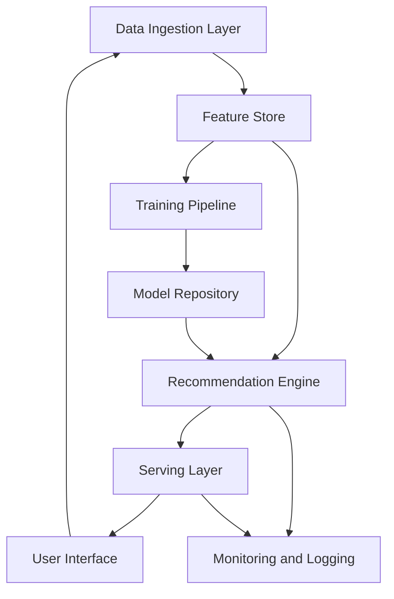

# Detailed Technical Algorithm for a TikTok-like Recommendation System

---

## 1. Introduction

The objective is to develop a recommendation system that maximizes user engagement by analyzing a multitude of user interaction signals to present the most appealing content. The system optimizes for two key metrics:

- **User Retention**: Encouraging users to return to the platform.
- **Time Spent**: Increasing the duration users spend on the platform per session.

---

## 2. Data Collection and Preprocessing

### 2.1. Event Logging

**User Interaction Events**:

- **Engagement Events**:
  - `like_event(user_id, content_id, timestamp)`
  - `comment_event(user_id, content_id, timestamp, comment_text)`
  - `share_event(user_id, content_id, timestamp, platform)`
  - `follow_event(user_id, creator_id, timestamp)`
  - `save_event(user_id, content_id, timestamp)`

- **Consumption Events**:
  - `view_event(user_id, content_id, timestamp, watch_duration)`
  - `complete_view_event(user_id, content_id, timestamp)`
  - `replay_event(user_id, content_id, timestamp)`

- **Negative Feedback Events**:
  - `skip_event(user_id, content_id, timestamp)`
  - `hide_event(user_id, content_id, timestamp)`
  - `report_event(user_id, content_id, timestamp, reason)`
  - `unfollow_event(user_id, creator_id, timestamp)`

**Content Metadata Events**:

- `content_upload_event(creator_id, content_id, timestamp, metadata)`

### 2.2. Data Storage Schema

- **User Profile Table**:

  | Field         | Type          |
  |---------------|---------------|
  | user_id       | STRING        |
  | demographics  | JSON          |
  | preferences   | JSON          |

- **Content Metadata Table**:

  | Field            | Type   |
  |------------------|--------|
  | content_id       | STRING |
  | creator_id       | STRING |
  | upload_timestamp | TIMESTAMP |
  | metadata         | JSON   |

- **Event Logs Table**:

  | Field          | Type      |
  |----------------|-----------|
  | event_id       | STRING    |
  | event_type     | STRING    |
  | user_id        | STRING    |
  | content_id     | STRING    |
  | timestamp      | TIMESTAMP |
  | additional_info| JSON      |

### 2.3. Data Preprocessing Pipeline

1. **Data Ingestion**:

   ```python
   def ingest_event(event):
       # Push event to processing queue
       processing_queue.put(event)
   ```

2. **Data Cleaning**:

   ```python
   def clean_event(event):
       if is_duplicate(event.event_id):
           return None
       event = handle_missing_values(event)
       event = correct_data_formats(event)
       return event
   ```

3. **Normalization and Encoding**:

   ```python
   from sklearn.preprocessing import MinMaxScaler, OneHotEncoder

   def normalize_features(features):
       scaler = MinMaxScaler()
       return scaler.fit_transform(features)

   def encode_categorical(features):
       encoder = OneHotEncoder()
       return encoder.fit_transform(features).toarray()
   ```

4. **Sessionization**:

   ```python
   def sessionize_events(events):
       sessions = []
       current_session = []
       last_timestamp = None
       for event in events:
           if last_timestamp and (event.timestamp - last_timestamp).seconds > 1800:
               sessions.append(current_session)
               current_session = []
           current_session.append(event)
           last_timestamp = event.timestamp
       sessions.append(current_session)
       return sessions
   ```

---

## 3. Feature Engineering

### 3.1. User Features

- **Engagement Scores**:

  ```python
  def calculate_engagement(user_id, category, engagements):
      total_engagements = sum(engagements.values())
      category_engagements = engagements.get(category, 0)
      engagement_score = category_engagements / total_engagements if total_engagements > 0 else 0
      return engagement_score
  ```

- **Recency-Weighted Engagement**:

  ```python
  import math

  def recency_weighted_engagement(events, lambda_decay=0.1, current_time):
      weighted_engagement = 0
      for event in events:
          time_diff = (current_time - event.timestamp).total_seconds()
          weight = math.exp(-lambda_decay * time_diff)
          weighted_engagement += event.engagement_value * weight
      return weighted_engagement
  ```

- **Behavioral Patterns**:

  ```python
  def average_session_duration(sessions):
      total_duration = sum(session.duration for session in sessions)
      return total_duration / len(sessions) if sessions else 0
  ```

### 3.2. Content Features

- **Textual Features**:

  ```python
  from sklearn.feature_extraction.text import TfidfVectorizer

  def extract_text_features(texts):
      vectorizer = TfidfVectorizer(max_features=500)
      tfidf_matrix = vectorizer.fit_transform(texts)
      return tfidf_matrix
  ```

- **Visual Features**:

  ```python
  from tensorflow.keras.applications.resnet50 import ResNet50, preprocess_input
  from tensorflow.keras.preprocessing import image
  import numpy as np

  def extract_visual_features(img_path):
      model = ResNet50(weights='imagenet', include_top=False)
      img = image.load_img(img_path, target_size=(224, 224))
      x = image.img_to_array(img)
      x = np.expand_dims(x, axis=0)
      x = preprocess_input(x)
      features = model.predict(x)
      return features.flatten()
  ```

- **Audio Features**:

  ```python
  import librosa

  def extract_audio_features(audio_path):
      y, sr = librosa.load(audio_path)
      mfccs = librosa.feature.mfcc(y=y, sr=sr, n_mfcc=40)
      return np.mean(mfccs.T, axis=0)
  ```

### 3.3. Contextual Features

- **Temporal Features**:

  ```python
  import math

  def encode_time_of_day(hour):
      hour_rad = 2 * math.pi * hour / 24
      return math.sin(hour_rad), math.cos(hour_rad)
  ```

### 3.4. Embedding Techniques

- **User Embeddings**:

  ```python
  import gensim

  def train_user_embeddings(interactions):
      model = gensim.models.Word2Vec(interactions, vector_size=128, window=5, min_count=1)
      return model
  ```

- **Content Embeddings**:

  ```python
  def combine_embeddings(text_emb, visual_emb, audio_emb):
      combined_emb = np.concatenate([text_emb, visual_emb, audio_emb])
      return combined_emb
  ```

---

## 4. Candidate Generation

### 4.1. Content Indexing

```python
import faiss

def build_content_index(embeddings):
    dimension = embeddings.shape[1]
    index = faiss.IndexFlatL2(dimension)
    index.add(embeddings)
    return index
```

### 4.2. Candidate Selection Algorithms

- **Content-Based Filtering**:

  ```python
  def content_based_candidates(user_embedding, content_embeddings, threshold):
      similarities = cosine_similarity(user_embedding, content_embeddings)
      candidates = np.where(similarities > threshold)[0]
      return candidates
  ```

- **Collaborative Filtering**:

  ```python
  from sklearn.neighbors import NearestNeighbors

  def collaborative_filtering(user_item_matrix, user_id, k=5):
      model_knn = NearestNeighbors(metric='cosine', algorithm='brute')
      model_knn.fit(user_item_matrix)
      distances, indices = model_knn.kneighbors(user_item_matrix[user_id], n_neighbors=k+1)
      similar_users = indices.flatten()[1:]
      return similar_users
  ```

- **Hybrid Approach**:

  ```python
  def hybrid_score(content_score, collab_score, alpha=0.5):
      return alpha * content_score + (1 - alpha) * collab_score
  ```

### 4.3. Diversity and Exploration

- **ε-Greedy Algorithm**:

  ```python
  import random

  def epsilon_greedy(recommendations, epsilon=0.1):
      if random.random() < epsilon:
          return random.choice(all_possible_contents)
      else:
          return recommendations[0]
  ```

- **Determinantal Point Processes (DPPs)**:

  ```python
  def dpp_selection(candidates, kernel_matrix, max_length):
      import dpp

      dpp_instance = dpp.DPP(kernel_matrix)
      selected_items = dpp_instance.sample_k(max_length)
      return [candidates[i] for i in selected_items]
  ```

---

## 5. Ranking Model

### 5.1. Model Architecture

```python
import tensorflow as tf
from tensorflow.keras.layers import Input, Dense, Concatenate
from tensorflow.keras.models import Model

def build_ranking_model(user_dim, content_dim, context_dim):
    user_input = Input(shape=(user_dim,), name='user_input')
    content_input = Input(shape=(content_dim,), name='content_input')
    context_input = Input(shape=(context_dim,), name='context_input')

    x = Concatenate()([user_input, content_input, context_input])
    x = Dense(256, activation='relu')(x)
    x = Dense(128, activation='relu')(x)
    x = Dense(64, activation='relu')(x)
    output = Dense(1, activation='sigmoid')(x)

    model = Model(inputs=[user_input, content_input, context_input], outputs=output)
    return model
```

### 5.2. Loss Function

```python
def custom_loss(y_true, y_pred):
    bce = tf.keras.losses.BinaryCrossentropy()
    loss = bce(y_true, y_pred)
    reg_loss = tf.reduce_sum(model.losses)
    return loss + reg_loss
```

### 5.3. Optimization Algorithm

```python
def get_optimizer(initial_lr=0.001, decay_steps=10000, decay_rate=0.96):
    learning_rate_fn = tf.keras.optimizers.schedules.InverseTimeDecay(
        initial_lr, decay_steps, decay_rate)
    optimizer = tf.keras.optimizers.Adam(learning_rate=learning_rate_fn)
    return optimizer
```

---

## 6. Online Learning and Model Updates

### 6.1. Incremental Training

```python
def incremental_training(model, data_generator, steps_per_update):
    for step, (x_batch, y_batch) in enumerate(data_generator):
        model.train_on_batch(x_batch, y_batch)
        if step % steps_per_update == 0:
            # Save model checkpoints or update serving model
            pass
```

### 6.2. Streaming Data Pipeline

```python
def data_buffering(event_stream, buffer_size):
    buffer = []
    for event in event_stream:
        buffer.append(event)
        if len(buffer) >= buffer_size:
            yield buffer
            buffer = []
```

### 6.3. Model Versioning

```python
def deploy_model(candidate_model, performance_metric, threshold):
    if performance_metric > threshold:
        # Promote candidate model to production
        production_model = candidate_model
    else:
        # Keep existing production model
        pass
```

---

## 7. System Architecture

### 7.1. Components and Data Flow



### 7.2. Abstracted Technologies

- **Messaging Queues**: For real-time data ingestion.
- **Distributed Storage Systems**: For scalable feature storage.
- **Model Serving Frameworks**: For low-latency inference.
- **Orchestration Tools**: For managing microservices and scaling.

---

## 8. Optimization Metrics

### 8.1. User Retention Metrics

- **Daily Active Users (DAU)**:

  ```python
  def calculate_dau(active_users):
      return len(set(active_users))
  ```

- **Retention Rate**:

  ```python
  def retention_rate(day_n_users, day_0_users):
      return len(day_n_users & day_0_users) / len(day_0_users)
  ```

### 8.2. Time Spent Metrics

- **Average Session Duration**:

  ```python
  def average_session_duration(sessions):
      total_duration = sum(session.duration for session in sessions)
      return total_duration / len(sessions)
  ```

### 8.3. Engagement Metrics

- **Click-Through Rate (CTR)**:

  ```python
  def calculate_ctr(clicks, impressions):
      return clicks / impressions if impressions > 0 else 0
  ```

- **Engagement Rate**:

  ```python
  def engagement_rate(total_engagements, content_views):
      return total_engagements / content_views if content_views > 0 else 0
  ```

### 8.4. Monitoring Tools

- Real-time analytics dashboards.
- Automated alert systems for threshold breaches.

---

## 9. Feedback Loop and Continuous Improvement

### 9.1. Incorporating User Feedback

```python
def update_user_preferences(user_id, feedback):
    user_profile = get_user_profile(user_id)
    user_profile.preferences = adjust_preferences(user_profile.preferences, feedback)
    save_user_profile(user_id, user_profile)
```

### 9.2. Adaptive Learning Rates

```python
def adjust_learning_rate(optimizer, validation_loss, prev_validation_loss):
    if validation_loss < prev_validation_loss:
        optimizer.learning_rate *= 1.05
    else:
        optimizer.learning_rate *= 0.5
```

### 9.3. Trend Detection

```python
def detect_trends(content_engagements):
    # Use time series analysis to identify trending content
    trending_content = []
    for content_id, engagements in content_engagements.items():
        if is_trending(engagements):
            trending_content.append(content_id)
    return trending_content
```

---

## 10. Ethical Considerations

### 10.1. Privacy Preservation

- **Data Anonymization**:

  ```python
  def anonymize_user_data(user_data):
      user_data.user_id = hash_function(user_data.user_id)
      return user_data
  ```

### 10.2. Content Moderation

- **Automated Filtering**:

  ```python
  def filter_content(content):
      if contains_inappropriate_material(content):
          flag_for_review(content)
      return content
  ```

### 10.3. Avoiding Algorithmic Bias

- **Fairness Adjustment**:

  ```python
  def adjust_for_fairness(recommendations):
      # Re-rank or adjust scores to promote diversity
      return fairness_algorithm(recommendations)
  ```

---

## 11. Testing and Validation

### 11.1. Offline Evaluation

```python
from sklearn.metrics import roc_auc_score

def evaluate_model(model, X_test, y_test):
    y_pred = model.predict(X_test)
    auc = roc_auc_score(y_test, y_pred)
    return auc
```

### 11.2. Online Testing

```python
def a_b_test(control_group, treatment_group):
    control_metrics = collect_metrics(control_group)
    treatment_metrics = collect_metrics(treatment_group)
    significance = statistical_significance(control_metrics, treatment_metrics)
    return significance
```

### 11.3. Load and Stress Testing

```bash
# Use a tool like Apache JMeter or Locust for stress testing
locust -f load_test_script.py
```

---

## 12. Deployment Strategy

### 12.1. Continuous Integration/Continuous Deployment (CI/CD)

```yaml
# Example of a CI/CD pipeline configuration
stages:
  - test
  - build
  - deploy

test_stage:
  script:
    - run_unit_tests.sh

build_stage:
  script:
    - build_docker_image.sh

deploy_stage:
  script:
    - deploy_to_production.sh
```

### 12.2. Rollback Mechanisms

```python
def rollback(deployment_id):
    previous_version = get_previous_version(deployment_id)
    deploy(previous_version)
```

### 12.3. Monitoring Post-Deployment

```python
def monitor_kpis():
    while True:
        kpis = get_current_kpis()
        if kpis_degrade(kpis):
            alert_team()
        time.sleep(monitoring_interval)
```

---

## Conclusion

This detailed technical algorithm provides a comprehensive framework for building a TikTok-like recommendation system. It encompasses data collection, feature engineering, candidate generation, model training, and deployment while emphasizing scalability, performance, and ethical considerations. By following this algorithm, developers can create a dynamic and responsive recommendation system aimed at maximizing user retention and engagement.

---

**Note**: The implementation of such a system requires careful attention to legal and ethical guidelines, particularly concerning user privacy and data protection laws.